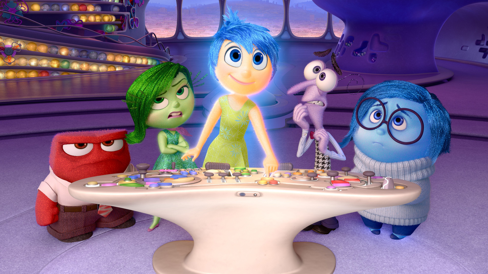

# Intensa Mente
 

## Ejercicio integrador

**Los neurólogos modernos, tras años de ardua investigación, han terminado de modelar una irrefutable y perfectamente viable teoría sobre los interiores de nuestra cabeza: cinco emociones (Alegría, Tristeza, Disgusto, Furia y Temor) dominan nuestra mente.
Y ahora nos toca modelar cómo estas emociones dominan la mente de Riley, una niñita de 11 años, y otras chicas similares a ella.**

###Vivir
De Riley conocemos:
- su nivel de felicidad, que inicialmente se encuentra en 1000
- cuál de las cinco emociones es la dominante (la cual puede cambiar en cualquier momento) 

Cuando ella vive un evento, el recuerdo asociado se agrega a sus recuerdos del día, incluyendo una descripción, la fecha y la emoción dominante de Riley en ese momento.

Todo recuerdo eventualmente se asienta, lo cual tiene consecuencias diferentes según la emoción dominante del recuerdo: 
- si el recuerdo es alegre, y el nivel de felicidad al momento de asentarse es mayor a 500, el recuerdo se convierte en un pensamiento central de Riley. 
- si el recuerdo es triste, se convierte automáticamente en un pensamiento central. Además, disminuye su coeficiente de felicidad en un 10%. El nivel resultante no puede quedar por debajo de 1: si esto ocurriera, se debe lanzar una excepción. 
- si el recuerdo es de disgusto, furioso o temeroso, no pasa nada.

En cualquier caso si se intenta asentar a un recuerdo que ya se había asentado, no pasa nada.

Se pide:

1. Hacer que Riley viva un evento, indicando la descripción del mismo, y registrando el recuerdo correspondiente
2. Asentar un recuerdo
3. Conocer los recuerdos recientes del día: estos son los últimos 5 recuerdos
4. Conocer los pensamientos centrales. Estos no tienen un orden particular y no tienen repetidos. 
5. Conocer los pensamientos centrales que sean difíciles de explicar. Un recuerdo es difícil de explicar cuando su descripción tiene más de 10 palabras

###Descansar

Dependiendo del estado de ánimo actual, la mente es buena para negar ciertos recuerdos que no le agradan. En particular: 

- la alegría niega todo lo que no sea alegre
- la tristeza niega sólo lo que es alegre
- las demás emociones no niegan nada. 

Por otro lado, a la hora de dormir ocurren muchos procesos mentales en la mente de Riley. Algunos de estos procesos son los siguientes (podría haber más):

- Asentamiento: todos los recuerdos del día se asientan.
- Asentamiento selectivo: similar al asentamiento, pero sólo asienta los recuerdos que contengan una palabra clave dada. 
- Profundización: todos los recuerdos no centrales del día y que no sean negados por el estado de ánimo actual, se envían a la memoria a largo plazo. 
- Control hormonal: si se detecta que un pensamiento central está también en la memoria a largo plazo, o si todos los recuerdos del día presentan la misma emoción dominante, se produce un desequilibrio hormonal. Esto consiste en que el nivel de felicidad disminuye en un 15% y se pierden los tres pensamientos centrales más antiguos. 
- Restauración cognitiva: se restauran hasta 100 puntos de felicidad (nunca se superan los 1000)
- Liberación de recuerdos del día: todos los recuerdos del día se liberan, es decir, dejan de ser recuerdos del día. Este proceso siempre es el último en ocurrir. 

Se pide:
6. Saber si Riley niega un recuerdo
7. Enviar a Riley a dormir, desencadenando todos sus procesos mentales

###Rememorar

Los viejos recuerdos a largo plazo pueden ser rememorados. Al rememorar, Riley trae un recuerdo cualquiera de la memoria a largo plazo que sea más antiguo que la mitad de su edad, y se convierte en su pensamiento actual. 

Finalmente, descubrimos que existen emociones compuestas: se trata de emociones que están conformadas por otras dos o más emociones. Un emoción compuesta:
- niega un recuerdo si todas sus emociones lo niegan
- es alegre si alguna de sus emociones es alegre
- asienta a un recuerdo aplicando la lógica de todas sus emociones

Se pide:

8. Hacer rememorar algo a Riley 
9. Extrañas circunstancias aún no entendidas podrían hacer que los recuerdos en la memoria a largo plazo se repitieran. Conocer la cantidad de repeticiones de un recuerdo en la memoria a largo plazo. 
10. Saber si Riley está teniendo un deja vú: esto ocurre cuando está pensando algo que es un recuerdo repetido en la memoria a largo plazo.
11. Modelar las emociones compuestas

